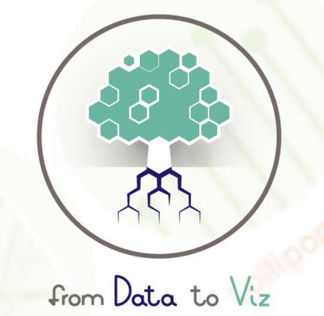

<style type="text/css">

/* ===== TABLA DE CONTENIDOS (TOC) ===== */
.toc {
  color: #1E293B !important; /* Azul oscuro para coincidir con el navbar */
  font-weight: bold;
}

.list-group-item.active, 
.list-group-item.active:focus, 
.list-group-item.active:hover {
    z-index: 2;
    color: #FACC15 !important; /* Amarillo brillante para contraste */
    background-color: #1E293B !important; /* Azul oscuro igual que la navbar */
    border-color: #1E293B !important; /* Consistente con el fondo */
}

/* ===== NAVBAR: Estilos generales ===== */
.navbar {
  position: fixed; /* Fija la navbar en la parte superior */
  display: flex;
  justify-content: center; /* Centra todo el contenido de la navbar */
  align-items: center;
  width: 100%;
  top: 0;
  left: 0;
  z-index: 1000; /* Asegurar que esté sobre otros elementos */
  background-color: #1E293B !important; /* Color de fondo */
  border-bottom: 3px solid #334155; /* Borde inferior */
}

/* Asegurar que el contenido no quede oculto debajo de la navbar */
body {
  padding-top: 70px; /* Ajustar el espacio superior según la altura de la navbar */
}

/* Quitar cualquier degradado de fondo heredado del tema */
.navbar-default {
  background-image: none !important;
}

/* Estilos de los enlaces de la barra de navegación */
.navbar-default .navbar-nav > li > a {
  color: #E5E7EB !important; /* Texto gris claro */
  font-weight: bold !important;
  font-size: 16px !important;
  text-transform: uppercase;
  padding: 12px 18px !important;
  text-decoration: none !important;
  transition: color 0.3s ease-in-out;
}

/* Alinear la navbar correctamente */
.navbar {
  display: flex;
  justify-content: center; /* Centra todo el contenido de la navbar */
  align-items: center;
  width: 100%;
}

/* Efecto al pasar el cursor */
.navbar-default .navbar-nav > li > a:hover,
.navbar-default .navbar-nav > li > a:focus {
  color: #FACC15 !important; /* Amarillo brillante */
  text-decoration: underline !important;
}

/* Enlace activo */
.navbar-default .navbar-nav > .active > a,
.navbar-default .navbar-nav > .active > a:hover,
.navbar-default .navbar-nav > .active > a:focus {
  color: #FACC15 !important;
  text-decoration: underline !important;
}

/* ===== MENÚ DESPLEGABLE ALINEADO A LA IZQUIERDA ===== */
.navbar-nav .dropdown-menu {
  background-color: #1E293B !important; /* Fondo oscuro */
  border: none !important;
  padding: 5px 0 !important;
  min-width: 200px;
  box-shadow: 0px 4px 6px rgba(0, 0, 0, 0.1);
  position: absolute;
  top: 100%;
  left: 0; /* Alinea el dropdown a la izquierda */
  text-align: left; /* Asegura que el texto también esté alineado a la izquierda */
}
.navbar-collapse {
  background-color: #1E293B;
}

/* Estilos para los enlaces dentro del dropdown */
.navbar-nav .dropdown-menu > li > a {
  color: #E5E7EB !important; /* Color de texto */
  font-size: 14px !important;
  padding: 10px 15px !important;
  transition: background 0.3s ease-in-out;
  display: block; /* Asegura que cada enlace ocupe toda la línea */
}

/* Hover en el dropdown */
.navbar-nav .dropdown-menu > li > a:hover {
  background-color: #334155 !important; /* Gris azulado más oscuro */
  color: #FACC15 !important; /* Amarillo brillante */
}

/* Asegurar alineación del dropdown */
.navbar-nav > li {
  position: relative;
  margin: 0 15px; /* Agrega espacio entre elementos */
}

/* Mostrar el submenú cuando se pasa el cursor */
.navbar-nav > li:hover .dropdown-menu {
  display: block;
  opacity: 1;
  visibility: visible;
}


/* ===== ESTILOS GENERALES ===== */
body {
  color: #2E3A46 !important;
  font-family: "Arial", sans-serif !important;
}

/* Estilos del título principal */
h1.title {
  text-align: center;
  font-weight: bold;
  width: 100%;
  margin: 20px 0;
  font-size: 42px;
  color: #0F172A;
}

/* Estilos para subtítulos */
h2, h3 {
  color: #001F3F;
  font-weight: bold;
  font-size: 22px;
  line-height: 1.4;
}

/* Color y tamaño de los párrafos */
p {
  color: #354A5F !important;
  font-size: 18px;
  line-height: 1.6;
}

/* ===== ESTILOS DE ENLACES ===== */
a {
  color: #582C35;
  text-decoration: underline;
}

a:hover {
  color: #005a9c;
  text-decoration: underline;
}

a:visited {
  color: #6C4F56;
}

a:active {
  color: #4A2C31;
}


/* ===== Estilos para listas numeradas (ol) y listas con viñetas (ul) ===== */
ol, ul {
  font-size: 20px !important; /* Aumenta el tamaño del texto */
  line-height: 1.8 !important; /* Mejora el espaciado entre líneas */
  color: #2E3A46 !important; /* Mantiene el color adecuado */
}

/* Asegurar que los elementos de la lista (li) también adopten el nuevo tamaño */
ol li, ul li {
  font-size: 20px !important; /* Tamaño grande */
  margin-bottom: 10px !important; /* Espacio entre elementos */
}


</style>


<br><br>


# ¿Cómo seleccionar la gráfica adecuada para tu análisis?
## 🌟 Data to Viz: Guía para la Visualización de Datos  

**Data to Viz** es una herramienta que clasifica los tipos de gráficos según el formato de los datos de entrada. Utiliza un árbol de decisión que orienta hacia las visualizaciones más adecuadas para representar un conjunto de datos.  

📌 **Principios clave:**  
1️⃣ La mayoría de los análisis de datos pueden resumirse en unos veinte formatos de dataset.  
2️⃣ Tanto los datos como su contexto determinan el gráfico adecuado.  

🔍 **Método sugerido:** Identificar y probar todas las visualizaciones viables para elegir la mejor opción.  

💡 *data-to-viz.com* ayuda a seleccionar el mejor gráfico, señala errores comunes y proporciona código reproducible en R.  

🚀 Aunque el mundo de la dataviz es infinito, este proyecto es un excelente punto de partida.  

<style>
  .custom-img {
    max-width: 400px; /* Ajusta según lo que prefieras */
    width: 100%;
    margin: 10px auto; /* Añade un poco de espacio alrededor */
    display: block; /* Asegura que la imagen no tenga alineaciones extrañas */
  }
</style>
<div class="full-width text-center">
  <a href="https://www.data-to-viz.com/#explore" target="_blank">
    
  </a>
</div>


<br><br>

<hr style="border: 3px solid#75124D;" />


# ¿Qué es un gráfico de barras apiladas?

Un gráfico de barras apiladas permite mostrar la desagregación por alguna variable categórica. La primera (y principal) categoría se coloca en la base de la barra, mientras que las otras se apilan dentro de cada barra, sean horizontales o verticales.

### Ejemplo

Supongamos que tenemos los niveles de producción total y las proyecciones de varios tipos de dispositivos: tabletas, teléfonos y laptops. Un gráfico de barras estándar mostraría la producción total, pero si queremos visualizar también la contribución de cada dispositivo, podemos utilizar un gráfico de barras apiladas.

### ¿Cuándo usar gráficos de barras apiladas?

Los gráficos de barras apiladas son útiles cuando se necesita mostrar tanto el total general como la distribución de los subcomponentes. Por ejemplo, si queremos comparar la producción total de dispositivos a lo largo de varios años y también la participación de cada tipo de dispositivo, un gráfico de barras apiladas es adecuado.

```{r, echo=FALSE}
library(ggplot2)

datos <- data.frame(
  anio = rep(2018:2023, each = 3),
  dispositivo = rep(c("Tabletas", "Teléfonos", "Laptops"), times = 6),
  produccion = c(500, 1500, 800, 450, 1400, 750, 400, 1200, 700, 600, 1600, 850, 650, 1700, 900, 700, 1800, 950)
)

ggplot(datos, aes(x = factor(anio), y = produccion, fill = dispositivo)) +
  geom_bar(stat = "identity") +
  labs(title = "Producción de dispositivos", x = "Año", y = "Producción") +
  theme_minimal()
```

### ¿Cuándo no usar gráficos de barras apiladas?

No se recomienda utilizar gráficos de barras apiladas si el objetivo principal es comparar subcomponentes entre las barras, ya que las categorías que no se encuentran en la base son más difíciles de comparar.

### Variaciones de gráficos de barras apiladas

- **Gráfico de barras apiladas al 100%**: Puedes optar por visualizar porcentajes en lugar de valores absolutos, extendiendo las barras de 0 a 100%. Esto facilita la comparación de categorías entre barras gracias a un punto de partida consistente. Por ejemplo, al enfatizar la producción de tabletas y teléfonos, se pueden colocar una categoría en la parte superior y otra en la inferior para observar cambios en proporción.
- **Gráfico de barras apiladas horizontales**: Cualquier versión de un gráfico de barras apiladas puede orientarse de forma vertical u horizontal. Aunque el tiempo suele presentarse de izquierda a derecha, la orientación horizontal puede ser útil para otros tipos de variables.

### Buenas prácticas
- Coloca la **categoría más importante en la base** para facilitar su comparación a lo largo de las barras. En el ejemplo adjunto, se muestra cómo colocar una categoría como "Tabletas" en la base facilita ver su aumento.

### Ejemplo con R
Este código genera un gráfico similar al de la imagen, donde colocar una categoría clave en la base facilita la interpretación.

### Comparación de gráficos
````{r, echo=FALSE, message=FALSE, warning=FALSE}
library(ggplot2)
library(gridExtra)

# Paleta de colores basada en la imagen proporcionada
colores <- c("#003057", "#00BFB3", "#A590FF", "#FFAC00", "#5FA48C", "#E600A9")

datos <- data.frame(
  anio = rep(2018:2023, each = 3),
  dispositivo = rep(c("Tabletas", "Teléfonos", "Laptops"), times = 6),
  produccion = c(500, 1500, 800, 450, 1400, 750, 400, 1200, 700, 600, 1600, 850, 650, 1700, 900, 700, 1800, 950)
)

datos2 <- datos
datos2$dispositivo <- factor(datos2$dispositivo, levels = c("Tabletas", "Teléfonos", "Laptops"))

datos3 <- datos
datos3$dispositivo <- factor(datos3$dispositivo, levels = c("Laptops", "Teléfonos", "Tabletas"))

g1 <- ggplot(datos2, aes(x = factor(anio), y = produccion, fill = dispositivo)) +
  geom_bar(stat = "identity", position = "fill") +
  scale_fill_manual(values = colores) +
  labs(title = "Difícil ver el incremento de tabletas", x = "Año", y = "Proporción") +
  theme_minimal()+
  theme(legend.position = "bottom", legend.title = element_blank())

g2 <- ggplot(datos3, aes(x = factor(anio), y = produccion, fill = dispositivo)) +
  geom_bar(stat = "identity", position = "fill") +
  scale_fill_manual(values = colores) +
  labs(title = "Fácil ver el incremento de tabletas", x = "Año", y = "Proporción") +
  theme_minimal()+
  theme(legend.position = "bottom", legend.title = element_blank())

grid.arrange(g1, g2, ncol = 2)
````
---
Este documento se basó en el artículo original [What is a stacked bar chart?](https://www.storytellingwithdata.com/blog/stacked-bars) de Storytelling with Data.

<br><br>

<hr style="border: 3px solid#75124D;" />


# El problema con las gráficas de pastel

Este documento adapta el contenido de "The issue with pie chart" de Data-to-Viz.com para explicar por qué las gráficas de pastel deben evitarse.

```{r, echo=FALSE, message=FALSE, warning=FALSE}
# Cargar librerías necesarias
library(ggplot2)
library(dplyr)

# Datos de ejemplo
set.seed(123)
data <- data.frame(
  group = c("A", "B", "C", "D"),
  value = c(30, 20, 25, 25)
)

# Gráfica de pastel
pie <- ggplot(data, aes(x = "", y = value, fill = group)) +
  geom_bar(stat = "identity", width = 1) +
  coord_polar(theta = "y") +
  labs(title = "Gráfica de pastel", x = NULL, y = NULL) +
  theme_void()

pie
```

Aunque las gráficas de pastel son populares para mostrar proporciones, presentan problemas de interpretación debido a la dificultad de los humanos para comparar ángulos.

```{r, echo=FALSE, message=FALSE, warning=FALSE}
# Gráficas de pastel adicionales
set.seed(123)
data <- data.frame(
  group = c("A", "B", "C", "D"),
  value = c(30, 20, 25, 25)
)

colores <- c("#003057", "#00BFB3", "#A590FF", "#FFAC00", "#5FA48C", "#E600A9")

# Gráfica de pastel con colores personalizados
pie <- ggplot(data, aes(x = "", y = value, fill = group)) +
  geom_bar(stat = "identity", width = 1) +
  coord_polar(theta = "y") +
  labs(title = "Gráfica de pastel", x = NULL, y = NULL) +
  theme_void() + scale_fill_manual(values = colores[1:4])

p1 <- pie
p2 <- pie + scale_fill_manual(values = rev(colores[1:4]))
p3 <- pie + scale_fill_manual(values = colores[3:6])

grid.arrange(p1, p2, p3, ncol = 3)

```

Al intentar comparar varias gráficas de pastel, se dificulta identificar qué grupo tiene el valor más alto o cómo evolucionan los valores entre grupos.

## Mejor opción: Gráfica de barras

```{r, echo=FALSE, message=FALSE, warning=FALSE}
# Gráfica de barras
library(ggplot2)
library(dplyr)
library(gridExtra)


set.seed(123)
data <- data.frame(
  group = c("A", "B", "C", "D"),
  value = c(30, 20, 25, 25)
)

bar1 <- ggplot(data, aes(x = group, y = value, fill = group)) +
  geom_bar(stat = "identity") + theme_minimal() + scale_fill_manual(values = colores[1:4])

bar2 <- ggplot(data, aes(x = group, y = value, fill = group)) +
  geom_bar(stat = "identity") + theme_minimal() + scale_fill_manual(values = rev(colores[1:4]))

bar3 <- ggplot(data, aes(x = reorder(group, value), y = value, fill = group)) +
  geom_bar(stat = "identity") + theme_minimal() + scale_fill_manual(values = colores[3:6])

grid.arrange(bar1, bar2, bar3, ncol = 3)

```

La gráfica de barras revela diferencias claras entre los grupos y permite detectar patrones fácilmente, algo que no se logra con las gráficas de pastel.

### Errores comunes en gráficas de pastel:
- Uso de gráficos en 3D
- Leyendas separadas
- Porcentajes que no suman 100%
- Demasiados elementos
- Gráficas explotadas

*Este documento se basó en el artículo original: [The issue with pie chart - Data-to-Viz.com](https://www.data-to-viz.com/caveat/pie.html)**
<br><br>

<hr style="border: 3px solid#75124D;" />


# Lecturas 

- [Bunge, M. (2000). La Investigación científica su estrategia y su filosofía. Barcelona: S.XXI.](https://archive.org/details/BungeMarioLaInvestigacionCientificaSuEstrategiaYSuFilosofia)  
- [Martínez Valdes, Gustavo AND Huerta Silva, José Luis AND Lara Escalante, Mónica (2024). Gestión de la información para el análisis político. México: UNAM-FCPyS.](http://ciid.politicas.unam.mx/www/libros/9786073089791.pdf)  
- [Gerring, J. (2014). Metodología de las ciencias sociales. Madrid: Alianza](https://drive.google.com/file/d/1aUmK4HqTD43-4TtpYcxLaQVdkULHtZeB/view?usp=sharing).  
- [Guía definitiva para todo lo relacionado con R Markdown (la encontrarás muy útil a medida que mejores en esta habilidad](https://bookdown.org/yihui/rmarkdown/).    

<!-- ### third level header -->

<!-- Here's an even lower level header -->

<!-- # My second post (note the order) -->

<!-- 2018 | 7 | 23 Last compiled: `r Sys.Date()` -->

<!-- I'm writing this tutorial going from the top down. And, this is how it will be printed. So, notice the second post is second in the list. If you want your most recent post to be at the top, then make a new post starting at the top. If you want the oldest first, do, then keep adding to the bottom -->
<br><br>

<hr style="border: 3px solid#75124D;" />
# Iremos agregando material de R, como el que se muestra:

Tal vez quieras tomar una muestra de 100 números de una distribución normal con media = 0 y desviación estándar = 1, y luego quieres trazar un histograma. Puedes hacer esto aquí mismo usando un bloque de código r, como este:


```{r}
muestras <- rnorm(100, mean=0, sd=1)
hist(muestras)
```

<!-- When you knit this R Markdown document, you will see that the histogram is printed to the page, along with the R code. This document can be set up to hide the R code in the webpage, just delete the comment (hashtag), from the cold folding option in the yaml header up top. For purposes of letting yourself see the code, and me see the code, best to keep it the way that it is. You learn all of these things and more can be customized in each R code block. -->

<!-- # The big idea -->

<!-- Use this lab journal to record what you do in R. This way I will be able to see what you are doing and help you along the way. You will also be creating a repository of all the things you do. You can make posts about everything. Learning specific things in R (project unrelated), and doing things for the project that we will discuss at the beginning of the Fall semester. You can get started now by fiddling around with googling things, and trying stuff out in R. I've placed some helpful starting links in the links page on this website -->

<!-- # What can you do right now by yourself? -->

<!-- It's hard to learn programming when you don't have specific problems that you are trying to solve. Everything just seems abstract. -->

<!-- I wrote an [introductory programming book that introduces R](https://crumplab.github.io/programmingforpsych/), and gives some [concrete problems for you to solve](https://crumplab.github.io/programmingforpsych/programming-challenges-i-learning-the-fundamentals.html).  -->

<!-- To get the hang of journaling and solving the problems to learn programming, my suggestion is that you use this .Rmd file to solve the problems. It would look like this: -->

<!-- # Problem 1 -->

<!-- Do simple math with numbers, addition, subtraction, multiplication, division -->

<!-- ```{r} -->
<!-- 1+2 -->
<!-- 2*5 -->
<!-- 5/3 -->
<!-- (1+6+4)/5 -->

<!-- ``` -->

<!-- # Problem 2 -->

<!-- Put numbers into variables, do simple math on the variables -->

<!-- ```{r} -->
<!-- a<-1 -->
<!-- b<-2 -->
<!-- a+b -->

<!-- d<-c(1,2,3) -->
<!-- e<-c(5,6,7) -->
<!-- d+e -->
<!-- d*e -->
<!-- d/e -->

<!-- ``` -->

<!-- # Problem 3 -->

<!-- Write code that will place the numbers 1 to 100 separately into a variable using for loop. Then, again using the seq function. -->

<!-- ```{r} -->
<!-- # for loop solution -->
<!-- # i becomes the number 1 to 100 at each step of the loop -->


<!-- a <- length(100) # make empty variable, set length to 100 -->
<!-- for (i in 1:100){ -->
<!--   a[i] <-i #assigns the number in i, to the ith index of a -->
<!-- } -->

<!-- print(a) -->

<!-- # for loop solution #2 -->

<!-- a<-c() #create empty variable using combine command -->
<!-- for (i in 1:100){ -->
<!--   a<-c(a,i) # keeps combining a with itself and the new number in i -->
<!-- } -->
<!-- print(a) -->

<!-- # seq solution -->
<!-- a <- seq(1,100,1) # look up help for seq using ?seq() in console -->
<!-- print(a) -->

<!-- ``` -->

<!-- # Replace this with problem 4 -->

<!-- And keep going. Try to solve the problems with different scripts that provide the same solution. Good luck, Happy coding. -->
<br><br>

<hr style="border: 3px solid#75124D;" />

# Comentarios y dudas:


<div id="disqus_thread"></div>
<script>
    /**
    *  RECOMMENDED CONFIGURATION VARIABLES: EDIT AND UNCOMMENT THE SECTION BELOW TO INSERT DYNAMIC VALUES FROM YOUR PLATFORM OR CMS.
    *  LEARN WHY DEFINING THESE VARIABLES IS IMPORTANT: https://disqus.com/admin/universalcode/#configuration-variables    */
    /*
    var disqus_config = function () {
    this.page.url = https://danserca.github.io/Consulta-de-Fuentes-y-Lectura-Numerica-del-Mundo-con-R/index.html;  // Replace PAGE_URL with your page's canonical URL variable
    this.page.identifier = CFLNM_0032_2025; // Replace PAGE_IDENTIFIER with your page's unique identifier variable
    };
    */
    (function() { // DON'T EDIT BELOW THIS LINE
    var d = document, s = d.createElement('script');
    s.src = 'https://cflnm2024-0032-disqus-com.disqus.com/embed.js';
    s.setAttribute('data-timestamp', +new Date());
    (d.head || d.body).appendChild(s);
    })();
</script>
<noscript>Please enable JavaScript to view the <a href="https://disqus.com/?ref_noscript">comments powered by Disqus.</a></noscript>
