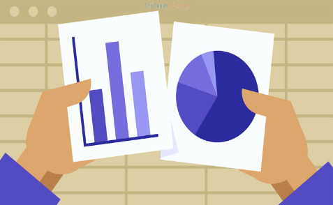

Bienvenida, bienvenido  

Este sitio web es una **herramienta interna colaborativa**, diseñada para fortalecer las capacidades del equipo en la **comunicación, visualización y ciudadanización de las estadísticas de gobierno**.  

No sustituye, contradice ni desafía los [**manuales de identidad**](https://sc.inegi.org.mx/repositorioNormateca/MII_2024.pdf) o el [**sistema visual institucional**](https://intranet.inegi.org.mx/docs/Imagen_Institucional/sistema_visual.pdf), cuyo uso es obligatorio. Su propósito es complementar estos lineamientos, proporcionando orientación para mejorar la efectividad en la **comunicación visual y escrita**.  
   

Inspirado en diversas iniciativas, este espacio busca crear una **comunidad activa y comprometida** con el aprendizaje, la actualización constante y la mejora de la difusión de datos hacia la sociedad.

## 📌 **Nuestra Visión**  

El **Portal de Fortalecimiento Estadístico** está construido sobre los valores fundamentales de:  

- **Accesibilidad**  
- **Soporte mutuo**  
- **Estructura organizada**  
- **Colaboración continua**  

Aspiramos a fomentar un entorno donde el conocimiento **fluya libremente**, y donde cada integrante del equipo pueda crecer y contribuir al desarrollo de **estadísticas más claras, accesibles y útiles** para la ciudadanía.  

## 🚀 **Qué Ofrecemos**  

Este espacio incluye **recursos, cursos, guías y herramientas clave** para mejorar en:  

✔ **Redacción y comunicación estadística efectiva**  
✔ **Visualización de datos comprensible y accesible**  
✔ **Ciudadanización de las estadísticas**, promoviendo un lenguaje claro y cercano  
✔ **Aprovechamiento del código abierto**, fomentando la transparencia y el intercambio de buenas prácticas  

## 🌎 **Comunidad y Colaboración**  

Este portal es más que una plataforma de aprendizaje: es un **espacio de socialización e inspiración**.  

Aquí, el compromiso con el equipo y con la sociedad se traduce en la **creación de contenidos estadísticos más relevantes y accesibles**, para contribuir a la toma de decisión informada.

## 🎯 **Ventajas de Participar**  

Al unirte a esta plataforma, accedes a:  

📚 **Recursos y soporte continuo** para tus proyectos y publicaciones  
📊 **Capacitación en herramientas de comunicación y visualización de datos**  
🤝 **Acceso a una comunidad de aprendizaje**, donde podrás compartir experiencias, resolver dudas y fortalecer tus habilidades  
💡 **Inspiración y nuevas ideas** para mejorar la difusión de los resultados estadísticos  

Este portal representa nuestro compromiso con el **fortalecimiento de las estadísticas de gobierno**, con el propósito de hacerlas más cercanas, útiles y significativas para la ciudadanía.  

> **Juntas y juntos, construimos un puente claro, efectivo y eficiente entre la información y acción.**  

Disfruta y envía recomendaciones a este espacio

<!-- ### [Crump Lab: Human Cognition and Performance](https://crumplab.github.io) -->

<!-- <a href = "https://crumplab.github.io"> -->

</a>

